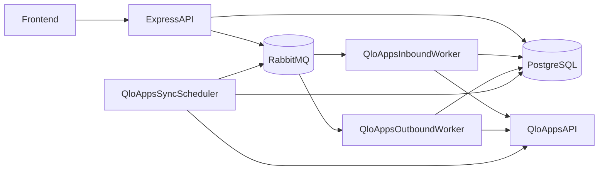

# Hotel PMS Backend Architecture

## Overview

The backend is a TypeScript + Express application for hotel operations.
It stores operational data in PostgreSQL and syncs channel-manager data with QloApps using RabbitMQ-backed workers.

Core runtime components:

- API server (`src/server.ts`)
- QloApps inbound worker (`src/integrations/qloapps/workers/inbound_worker.ts`)
- QloApps outbound worker (`src/integrations/qloapps/workers/outbound_worker.ts`)
- QloApps sync scheduler (`src/integrations/qloapps/workers/sync_scheduler.ts`)
- PostgreSQL
- RabbitMQ

## High-level Flow

## API Layer

- App bootstrap: `src/server.ts` and `src/app.ts`
- Route aggregation: `src/routes.ts`
- Feature services live under `src/services/*` (auth, rooms, reservations, guests, invoices, settings, etc.)

Patterns currently used:

- Controllers + route modules per feature
- Knex query builder for persistence
- Shared auth and role middleware
- Non-blocking sync triggers for channel updates

## Integration Layer (QloApps only)

All integration logic is under `src/integrations/qloapps/`:

- `qloapps_client.ts`: HTTP client for QloApps API
- `services/*`: pull/push orchestration and sync services
- `queue/*`: exchange/queue topology, publisher, and consumer base
- `workers/*`: long-running consumers and scheduler
- `hooks/sync_hooks.ts`: application hooks used by domain controllers

### Queue Topology

The integration uses RabbitMQ topic exchange + durable queues with DLQ support.

- Exchange: QloApps events exchange
- Inbound queue: remote to local sync operations
- Outbound queue: local to remote sync operations
- Dead-letter queues for failed processing

This design keeps API writes fast and moves sync retries/error handling to workers.

## Data Layer

- PostgreSQL is the system of record for PMS data.
- Knex migrations and seeds define schema and baseline data.
- Sync state/mappings are persisted in dedicated tables for traceability and idempotency.

Important implementation detail:

- `src/config/database.ts` overrides PostgreSQL DATE parsing to preserve exact date strings and avoid timezone drift.

## Worker Model

### Inbound Worker

Consumes inbound QloApps events and applies changes to local PMS records.

### Outbound Worker

Consumes locally queued sync jobs and pushes updates to QloApps.

### Sync Scheduler

Runs periodic pull syncs for configured hotels with lock + backoff behavior.

## Development Runtime

Orchestration lives at the **repository root**:

- `docker-compose.yml` — service definitions (no bind mounts; image + named volumes only)
- `docker-compose.dev.yml` — **bind mounts**, Vite port `5173`, and `host.docker.internal` for API/workers (hot reload)
- `.env` / `.env.example`: `COMPOSE_FILE=docker-compose.yml:docker-compose.dev.yml` so `docker compose up` uses both files by default
- `workers` profile: QloApps workers (`worker-inbound`, `worker-outbound`, `worker-scheduler`)
- `infra` profile: optional local QloApps container (`qloapps`)
- `tools` profile: one-shot `migrate` and `seed` services

Published PostgreSQL uses `HOST_DB_PORT` on the host (default `5432`); inside the compose network the API still uses `DB_HOST=postgres` and `DB_PORT=5432`.

Production-like overrides: `docker compose -f docker-compose.yml -f docker-compose.prod.yml up -d` (overrides `COMPOSE_FILE` when `-f` is passed). Uses production `Dockerfile` builds without dev bind mounts; **Caddy** listens on `CADDY_HTTP_PORT` / `CADDY_HTTPS_PORT` (defaults 80/443), terminates TLS automatically for real DNS names (`PUBLIC_APP_DOMAIN`), routes `/api*` to the API and other paths to the static SPA. Set `VITE_PROD_API_URL` (typically `https://<PUBLIC_APP_DOMAIN>/api`) for the frontend build. VM deployments use the same Caddy pattern under `infra/docker/` (API-only Caddyfile). Do not enable dev-only flags such as `ALLOW_DEFAULT_HOTEL` in production.

Common local flow:

1. From repo root: `cp .env.example .env`, then `docker compose up -d`
2. Once Postgres is healthy: `docker compose --profile tools run --rm migrate` then `seed` as needed
3. Optional: `docker compose --profile workers up -d` and/or `--profile infra`

## Design Decisions

- Keep RabbitMQ: reliable async processing, retry behavior, and DLQ visibility
- Keep Knex migrations: predictable schema evolution
- Keep feature-oriented service structure: low coupling and readable boundaries
- Remove unused multi-provider abstractions until a second provider is required

## Multi-property tenancy

- **Tenant**: Each **hotel** row is an independent property. Operational data (rooms, reservations, guests, invoices, maintenance, audit rows, etc.) is scoped with `hotel_id`.
- **Property context**: Authenticated API requests that operate on tenant data use middleware **`hotelContext`** after **`authenticateToken`**. The client sends **`X-Hotel-Id`** with the active property UUID. **`SUPER_ADMIN`** may call any hotel they pass in the header; other roles must be linked in **`user_hotels`**.
- **Production**: Missing `X-Hotel-Id` on `hotelContext` routes returns **400** with `code: PROPERTY_CONTEXT_REQUIRED`. For local scripts and tests only, set **`ALLOW_DEFAULT_HOTEL=true`** (non-production) to allow the legacy default UUID; never enable in production.
- **Global routes (no hotel header)**: `/api/auth/*`, **`/api/v1/hotels`** (list/manage properties), and **`/api/v1/users`** (user admin uses JWT only; hotel assignment rules are enforced in the users service).
- **Frontend**: Users with multiple assigned properties must **select** an active hotel; the SPA stores it and sends `X-Hotel-Id` on operational calls.

## Out of Scope

The backend does not currently implement:

- Redis or Bull queues
- WebSocket realtime transport
- Multi-channel-manager strategy runtime

Any documentation or code claiming these as active architecture is outdated.
