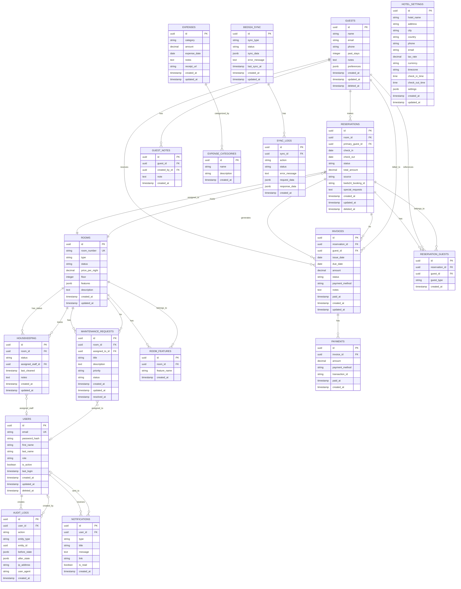

# Hotel Management System (PMS) - Entity Relationship Diagram

## Document Information

- **Version:** 1.0
- **Date:** December 2024
- **Status:** Production Ready
- **System:** Hotel Property Management System (PMS)

---

## Overview

This document presents the Entity Relationship Diagram (ERD) for the Hotel Property Management System. The ERD illustrates all entities, their attributes, and the relationships between them.

---

## Entity Relationship Diagram

---

## Entity Descriptions

### Core Entities

#### USERS
Represents system users with different roles (Super Admin, Admin, Manager, Front Desk, Housekeeping, Maintenance, Viewer).

**Key Attributes:**
- `id`: Unique identifier (UUID)
- `email`: User email (unique)
- `role`: User role (enum)

**Relationships:**
- Creates AUDIT_LOGS (one-to-many)
- Receives NOTIFICATIONS (one-to-many)
- Assigned to HOUSEKEEPING (one-to-many)
- Assigned to MAINTENANCE_REQUESTS (one-to-many)

---

#### HOTEL_SETTINGS
Stores hotel configuration and settings. Single record table for the hotel property (approximately 30 rooms).

**Key Attributes:**
- `id`: Fixed UUID identifier
- `hotel_name`: Hotel name
- `address`, `city`, `country`: Location information
- `tax_rate`, `currency`, `timezone`: Business settings
- `check_in_time`, `check_out_time`: Standard times
- `settings`: JSONB for flexible configuration

**Note:** This is a single-record table storing hotel-wide configuration.

---

#### GUESTS
Represents guest profiles with contact information and history.

**Key Attributes:**
- `id`: Unique identifier (UUID)
- `name`, `email`, `phone`: Contact information
- `past_stays`: Number of previous stays
- `notes`: General notes about guest
- `preferences`: JSONB for guest preferences

**Relationships:**
- Makes RESERVATIONS (one-to-many)
- Receives INVOICES (one-to-many)
- Has GUEST_NOTES (one-to-many)
- Linked via RESERVATION_GUESTS (many-to-many)

---

#### ROOMS
Represents hotel rooms with status, pricing, and features. Approximately 30 rooms for this single hotel property.

**Key Attributes:**
- `id`: Unique identifier (UUID)
- `room_number`: Unique room identifier (globally unique for single hotel)
- `type`: Room type (Single, Double, Suite)
- `status`: Current status (Available, Occupied, Cleaning, Out of Service)
- `price_per_night`: Room rate
- `floor`: Floor number
- `features`: JSONB array of features

**Relationships:**
- Hosts RESERVATIONS (one-to-many)
- Has HOUSEKEEPING status (one-to-one)
- Has MAINTENANCE_REQUESTS (one-to-many)
- Has ROOM_FEATURES (one-to-many)

---

#### RESERVATIONS
Represents guest reservations with check-in/out dates and status.

**Key Attributes:**
- `id`: Unique identifier (UUID)
- `check_in`, `check_out`: Reservation dates
- `status`: Reservation status (Confirmed, Checked-in, Checked-out, Cancelled)
- `total_amount`: Calculated total
- `source`: Booking source (Direct, Beds24, OTA)
- `beds24_booking_id`: External booking reference

**Relationships:**
- Assigned to ROOMS (many-to-one)
- Made by GUESTS (many-to-one via primary_guest_id)
- Has RESERVATION_GUESTS (one-to-many)
- Generates INVOICES (one-to-many)

---

#### RESERVATION_GUESTS
Junction table for many-to-many relationship between reservations and guests (supports double rooms).

**Key Attributes:**
- `id`: Unique identifier (UUID)
- `reservation_id`: Foreign key to RESERVATIONS
- `guest_id`: Foreign key to GUESTS
- `guest_type`: Primary or Secondary

**Relationships:**
- Links RESERVATIONS and GUESTS (many-to-many)

---

### Financial Entities

#### INVOICES
Represents invoices generated from reservations.

**Key Attributes:**
- `id`: Unique identifier (UUID)
- `issue_date`, `due_date`: Invoice dates
- `amount`: Invoice amount
- `status`: Invoice status (Pending, Paid, Cancelled)
- `payment_method`: Payment method used

**Relationships:**
- Generated from RESERVATIONS (many-to-one)
- Billed to GUESTS (many-to-one)
- Has PAYMENTS (one-to-many)

---

#### PAYMENTS
Represents individual payment transactions for invoices.

**Key Attributes:**
- `id`: Unique identifier (UUID)
- `amount`: Payment amount
- `payment_method`: Method used
- `transaction_id`: External transaction reference
- `paid_at`: Payment timestamp

**Relationships:**
- Belongs to INVOICES (many-to-one)

---

#### EXPENSES
Represents hotel operational expenses.

**Key Attributes:**
- `id`: Unique identifier (UUID)
- `category`: Expense category
- `amount`: Expense amount
- `expense_date`: Date of expense
- `notes`: Additional notes
- `receipt_url`: Receipt file path

**Relationships:**
- Categorized by EXPENSE_CATEGORIES (many-to-one)

---

### Operational Entities

#### HOUSEKEEPING
Tracks room cleaning status and assignments.

**Key Attributes:**
- `id`: Unique identifier (UUID)
- `status`: Cleaning status (Clean, Dirty, In Progress)
- `assigned_staff_id`: Assigned housekeeping staff
- `last_cleaned`: Last cleaning timestamp

**Relationships:**
- Tracks ROOMS (one-to-one)
- Assigned to USERS (many-to-one)

---

#### MAINTENANCE_REQUESTS
Represents maintenance requests for rooms.

**Key Attributes:**
- `id`: Unique identifier (UUID)
- `title`: Request title
- `description`: Detailed description
- `priority`: Priority level (Low, Medium, High, Urgent)
- `status`: Request status (Open, In Progress, Repaired)
- `resolved_at`: Resolution timestamp

**Relationships:**
- For ROOMS (many-to-one)
- Assigned to USERS (many-to-one)

---

### System Entities

#### AUDIT_LOGS
Tracks all system changes for compliance and debugging.

**Key Attributes:**
- `id`: Unique identifier (UUID)
- `action`: Action performed (CREATE, UPDATE, DELETE)
- `entity_type`: Type of entity modified
- `entity_id`: ID of modified entity
- `before_state`, `after_state`: JSONB snapshots
- `ip_address`, `user_agent`: Request metadata

**Relationships:**
- Created by USERS (many-to-one)

---

#### NOTIFICATIONS
Represents system notifications for users.

**Key Attributes:**
- `id`: Unique identifier (UUID)
- `type`: Notification type (checkin, checkout, invoice, cleaning, maintenance)
- `title`: Notification title
- `message`: Notification message
- `link`: Optional navigation link
- `is_read`: Read status

**Relationships:**
- Sent to USERS (many-to-one)

---

### Integration Entities

#### BEDS24_SYNC
Tracks synchronization status with Beds24 channel manager.

**Key Attributes:**
- `id`: Unique identifier (UUID)
- `sync_type`: Type of sync (PUSH, PULL, WEBHOOK)
- `status`: Sync status (Pending, Success, Failed)
- `sync_data`: JSONB sync payload
- `error_message`: Error details if failed
- `last_sync_at`: Last successful sync timestamp

**Relationships:**
- Has SYNC_LOGS (one-to-many)

---

#### SYNC_LOGS
Detailed logs for each Beds24 sync operation.

**Key Attributes:**
- `id`: Unique identifier (UUID)
- `action`: Specific sync action
- `status`: Operation status
- `request_data`, `response_data`: JSONB request/response
- `error_message`: Error details

**Relationships:**
- Belongs to BEDS24_SYNC (many-to-one)

---

### Supporting Entities

#### ROOM_FEATURES
Individual room features (normalized from JSONB for better querying).

**Key Attributes:**
- `id`: Unique identifier (UUID)
- `room_id`: Foreign key to ROOMS
- `feature_name`: Feature name (WiFi, TV, AC, etc.)

**Relationships:**
- Belongs to ROOMS (many-to-one)

---

#### GUEST_NOTES
Additional notes about guests with creator tracking.

**Key Attributes:**
- `id`: Unique identifier (UUID)
- `guest_id`: Foreign key to GUESTS
- `created_by_id`: Foreign key to USERS
- `note`: Note content

**Relationships:**
- Belongs to GUESTS (many-to-one)
- Created by USERS (many-to-one)

---

#### EXPENSE_CATEGORIES
Predefined expense categories.

**Key Attributes:**
- `id`: Unique identifier (UUID)
- `name`: Category name
- `description`: Category description

**Relationships:**
- Categorizes EXPENSES (one-to-many)

---

## Relationship Summary

### One-to-Many Relationships
- ROOMS → RESERVATIONS
- ROOMS → HOUSEKEEPING
- ROOMS → MAINTENANCE_REQUESTS
- GUESTS → RESERVATIONS
- GUESTS → INVOICES
- RESERVATIONS → INVOICES
- INVOICES → PAYMENTS
- USERS → AUDIT_LOGS
- USERS → NOTIFICATIONS
- BEDS24_SYNC → SYNC_LOGS

### Many-to-Many Relationships
- RESERVATIONS ↔ GUESTS (via RESERVATION_GUESTS)

### One-to-One Relationships
- ROOMS ↔ HOUSEKEEPING

---

## Indexes and Constraints

### Primary Keys
All entities use UUID as primary key for better distribution and security.

### Foreign Keys
All foreign key relationships enforce referential integrity with appropriate CASCADE or RESTRICT actions.

### Unique Constraints
- `USERS.email` - Unique email per user
- `ROOMS.room_number` - Unique room number per property
- `RESERVATIONS` - Unique constraint on (room_id, check_in, check_out) where status != 'Cancelled'

### Indexes
- `USERS.email` - For login lookups
- `RESERVATIONS.check_in`, `RESERVATIONS.check_out` - For availability queries
- `RESERVATIONS.status` - For filtering
- `AUDIT_LOGS.created_at` - For time-based queries
- `AUDIT_LOGS.entity_type`, `AUDIT_LOGS.entity_id` - For entity-specific queries
- `INVOICES.status` - For payment tracking
- `MAINTENANCE_REQUESTS.status`, `MAINTENANCE_REQUESTS.priority` - For filtering

---

## Data Types

### UUID
Used for all primary and foreign keys for better distribution and security.

### JSONB
Used for flexible data storage:
- `PROPERTIES.settings` - Property configuration
- `GUESTS.preferences` - Guest preferences
- `ROOMS.features` - Room features array
- `AUDIT_LOGS.before_state`, `AUDIT_LOGS.after_state` - Audit snapshots
- `BEDS24_SYNC.sync_data` - Sync payloads

### Enums
- `USERS.role` - User roles
- `ROOMS.type` - Room types
- `ROOMS.status` - Room statuses
- `RESERVATIONS.status` - Reservation statuses
- `INVOICES.status` - Invoice statuses
- `HOUSEKEEPING.status` - Cleaning statuses
- `MAINTENANCE_REQUESTS.priority` - Priority levels
- `MAINTENANCE_REQUESTS.status` - Request statuses

### Timestamps
All entities include `created_at` and `updated_at` timestamps. Soft-deletable entities include `deleted_at`.

---

## Notes

1. **Single Hotel Design**: This ERD is designed for a single hotel property with approximately 30 rooms. The HOTEL_SETTINGS entity stores hotel-wide configuration as a single record.

2. **Double Room Support**: The RESERVATION_GUESTS junction table allows multiple guests per reservation, supporting double rooms and group bookings.

3. **Audit Trail**: Comprehensive audit logging tracks all changes with before/after states for compliance and debugging.

4. **Soft Deletes**: Critical entities (USERS, GUESTS, RESERVATIONS) support soft deletes via `deleted_at` for data retention and recovery.

5. **Beds24 Integration**: Dedicated entities track sync status and logs for reliable channel manager integration.

6. **Flexible Configuration**: JSONB columns allow for flexible, schema-less data where needed without migrations.

---

**Document End**

