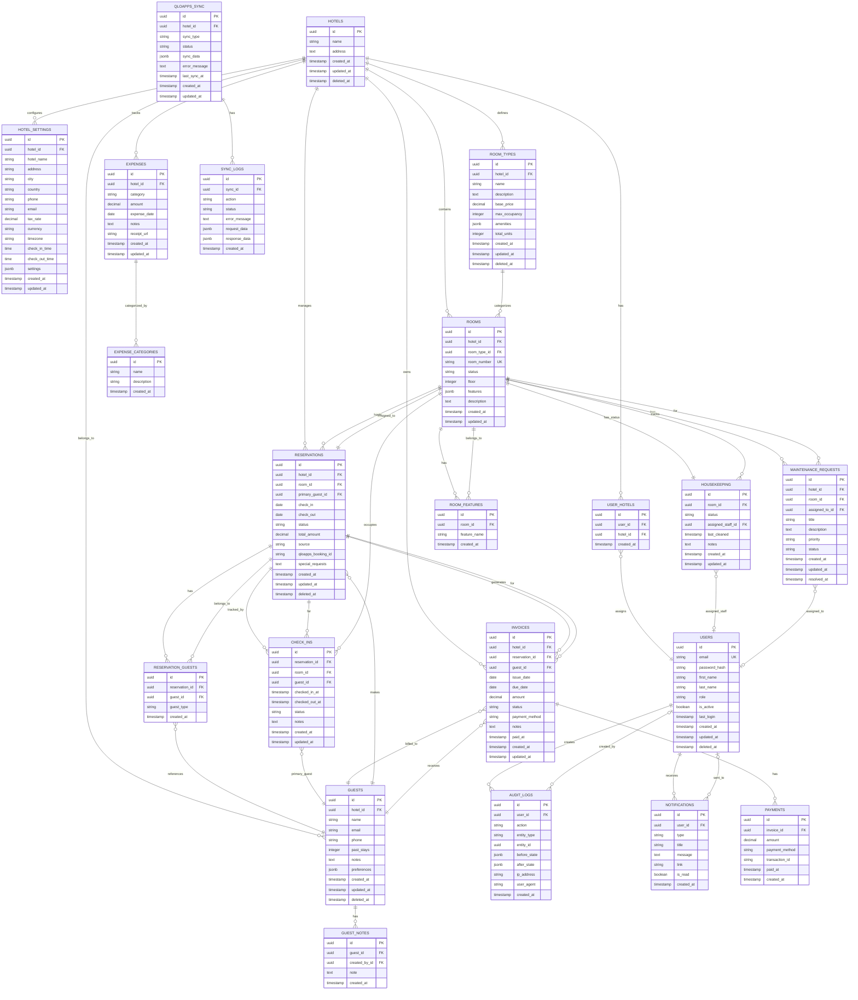

# Hotel Management System (PMS) - Entity Relationship Diagram

## Document Information

- **Version:** 2.0
- **Date:** 2026-04-14
- **Status:** Updated — Multi-Property design; QloApps integration; new entities added
- **System:** Hotel Property Management System (PMS) — Multi-Property

---

## Overview

This document presents the Entity Relationship Diagram (ERD) for the Hotel Property Management
System. The PMS is a **multi-property** platform: each hotel property is an independently
scoped tenant. All operational data belongs to a hotel via `hotel_id`. The ERD reflects the
actual as-built model from Knex migrations — not the earlier single-property documentation.

---

## Entity Relationship Diagram

```mermaid
erDiagram
    %% Multi-Property Core
    HOTELS ||--o{ HOTEL_SETTINGS : configures
    HOTELS ||--o{ USER_HOTELS : has
    USER_HOTELS }o--|| USERS : assigns
    HOTELS ||--o{ ROOM_TYPES : defines
    HOTELS ||--o{ ROOMS : contains
    HOTELS ||--o{ GUESTS : belongs_to
    HOTELS ||--o{ RESERVATIONS : manages
    HOTELS ||--o{ INVOICES : owns
    HOTELS ||--o{ EXPENSES : tracks

    %% Room hierarchy
    ROOM_TYPES ||--o{ ROOMS : categorizes

    %% Core Entities
    USERS ||--o{ AUDIT_LOGS : creates
    USERS ||--o{ NOTIFICATIONS : receives

    %% Guest and Reservation Entities
    GUESTS ||--o{ RESERVATIONS : makes
    GUESTS ||--o{ INVOICES : receives
    GUESTS ||--o{ GUEST_NOTES : has

    RESERVATIONS ||--|| ROOMS : assigned_to
    RESERVATIONS ||--o{ INVOICES : generates
    RESERVATIONS ||--o{ RESERVATION_GUESTS : has
    RESERVATIONS ||--o{ CHECK_INS : tracked_by

    RESERVATION_GUESTS }o--|| GUESTS : references
    RESERVATION_GUESTS }o--|| RESERVATIONS : belongs_to

    %% Check-in lifecycle
    CHECK_INS }o--|| RESERVATIONS : for
    CHECK_INS }o--|| ROOMS : occupies
    CHECK_INS }o--|| GUESTS : primary_guest

    %% Room Management
    ROOMS ||--|| HOUSEKEEPING : has_status
    ROOMS ||--o{ MAINTENANCE_REQUESTS : has
    ROOMS ||--o{ RESERVATIONS : hosts
    ROOMS ||--o{ ROOM_FEATURES : has

    ROOM_FEATURES }o--|| ROOMS : belongs_to

    %% Housekeeping
    HOUSEKEEPING }o--|| ROOMS : tracks
    HOUSEKEEPING }o--o| USERS : assigned_staff

    %% Maintenance
    MAINTENANCE_REQUESTS }o--|| ROOMS : for
    MAINTENANCE_REQUESTS }o--o| USERS : assigned_to

    %% Financial
    INVOICES }o--|| RESERVATIONS : for
    INVOICES }o--|| GUESTS : billed_to
    INVOICES ||--o{ PAYMENTS : has

    EXPENSES ||--o{ EXPENSE_CATEGORIES : categorized_by

    %% Audit and System
    AUDIT_LOGS }o--o| USERS : created_by
    NOTIFICATIONS }o--o| USERS : sent_to

    %% QloApps Integration
    QLOAPPS_SYNC ||--o{ SYNC_LOGS : has

    %% Entity Definitions
    HOTELS {
        uuid id PK
        string name
        text address
        timestamp created_at
        timestamp updated_at
        timestamp deleted_at
    }

    HOTEL_SETTINGS {
        uuid id PK
        uuid hotel_id FK
        string hotel_name
        string address
        string city
        string country
        string phone
        string email
        decimal tax_rate
        string currency
        string timezone
        time check_in_time
        time check_out_time
        jsonb settings
        timestamp created_at
        timestamp updated_at
    }

    USER_HOTELS {
        uuid id PK
        uuid user_id FK
        uuid hotel_id FK
        timestamp created_at
    }

    USERS {
        uuid id PK
        string email UK
        string password_hash
        string first_name
        string last_name
        string role
        boolean is_active
        timestamp last_login
        timestamp created_at
        timestamp updated_at
        timestamp deleted_at
    }

    ROOM_TYPES {
        uuid id PK
        uuid hotel_id FK
        string name
        text description
        decimal base_price
        integer max_occupancy
        jsonb amenities
        integer total_units
        timestamp created_at
        timestamp updated_at
        timestamp deleted_at
    }

    GUESTS {
        uuid id PK
        uuid hotel_id FK
        string name
        string email
        string phone
        integer past_stays
        text notes
        jsonb preferences
        timestamp created_at
        timestamp updated_at
        timestamp deleted_at
    }

    ROOMS {
        uuid id PK
        uuid hotel_id FK
        uuid room_type_id FK
        string room_number UK
        string status
        integer floor
        jsonb features
        text description
        timestamp created_at
        timestamp updated_at
    }

    RESERVATIONS {
        uuid id PK
        uuid hotel_id FK
        uuid room_id FK
        uuid primary_guest_id FK
        date check_in
        date check_out
        string status
        decimal total_amount
        string source
        string qloapps_booking_id
        text special_requests
        timestamp created_at
        timestamp updated_at
        timestamp deleted_at
    }

    CHECK_INS {
        uuid id PK
        uuid reservation_id FK
        uuid room_id FK
        uuid guest_id FK
        timestamp checked_in_at
        timestamp checked_out_at
        string status
        text notes
        timestamp created_at
        timestamp updated_at
    }

    RESERVATION_GUESTS {
        uuid id PK
        uuid reservation_id FK
        uuid guest_id FK
        string guest_type
        timestamp created_at
    }

    INVOICES {
        uuid id PK
        uuid hotel_id FK
        uuid reservation_id FK
        uuid guest_id FK
        date issue_date
        date due_date
        decimal amount
        string status
        string payment_method
        text notes
        timestamp paid_at
        timestamp created_at
        timestamp updated_at
    }

    PAYMENTS {
        uuid id PK
        uuid invoice_id FK
        decimal amount
        string payment_method
        string transaction_id
        timestamp paid_at
        timestamp created_at
    }

    HOUSEKEEPING {
        uuid id PK
        uuid room_id FK
        string status
        uuid assigned_staff_id FK
        timestamp last_cleaned
        text notes
        timestamp created_at
        timestamp updated_at
    }

    MAINTENANCE_REQUESTS {
        uuid id PK
        uuid hotel_id FK
        uuid room_id FK
        uuid assigned_to_id FK
        string title
        text description
        string priority
        string status
        timestamp created_at
        timestamp updated_at
        timestamp resolved_at
    }

    EXPENSES {
        uuid id PK
        uuid hotel_id FK
        string category
        decimal amount
        date expense_date
        text notes
        string receipt_url
        timestamp created_at
        timestamp updated_at
    }

    AUDIT_LOGS {
        uuid id PK
        uuid user_id FK
        string action
        string entity_type
        uuid entity_id
        jsonb before_state
        jsonb after_state
        string ip_address
        string user_agent
        timestamp created_at
    }

    NOTIFICATIONS {
        uuid id PK
        uuid user_id FK
        string type
        string title
        text message
        string link
        boolean is_read
        timestamp created_at
    }

    QLOAPPS_SYNC {
        uuid id PK
        uuid hotel_id FK
        string sync_type
        string status
        jsonb sync_data
        text error_message
        timestamp last_sync_at
        timestamp created_at
        timestamp updated_at
    }

    SYNC_LOGS {
        uuid id PK
        uuid sync_id FK
        string action
        string status
        text error_message
        jsonb request_data
        jsonb response_data
        timestamp created_at
    }

    ROOM_FEATURES {
        uuid id PK
        uuid room_id FK
        string feature_name
        timestamp created_at
    }

    GUEST_NOTES {
        uuid id PK
        uuid guest_id FK
        uuid created_by_id FK
        text note
        timestamp created_at
    }

    EXPENSE_CATEGORIES {
        uuid id PK
        string name
        string description
        timestamp created_at
    }
```

---

## Entity Descriptions

### Multi-Property Core Entities

#### HOTELS
Root entity for the multi-property platform. Each hotel is an independently scoped tenant.
All operational data belongs to a hotel via `hotel_id`.

**Key Attributes:**
- `id`: Unique identifier (UUID)
- `name`: Hotel property name

**Relationships:**
- Has HOTEL_SETTINGS (one-to-one per property)
- Has USER_HOTELS assignments (one-to-many)
- Contains ROOM_TYPES and ROOMS (one-to-many)
- Owns GUESTS, RESERVATIONS, INVOICES, EXPENSES, MAINTENANCE (one-to-many)

---

#### HOTEL_SETTINGS
Per-property configuration. Each hotel property has exactly one settings record.

**Key Attributes:**
- `hotel_id`: FK to HOTELS (per-property scope)
- `hotel_name`, `address`, `city`, `country`: Location
- `tax_rate`, `currency`, `timezone`: Business settings
- `check_in_time`, `check_out_time`: Standard times
- `settings`: JSONB for flexible additional configuration

---

#### USER_HOTELS
Property assignment table. Users can be assigned to one or more hotel properties.
`SUPER_ADMIN` users bypass hotel scoping and can access all properties.

**Key Attributes:**
- `user_id`: FK to USERS
- `hotel_id`: FK to HOTELS

---

### Core Entities

#### USERS
Represents system users with different roles (Super Admin, Admin, Manager, Front Desk, Housekeeping, Maintenance, Viewer).

**Key Attributes:**
- `id`: Unique identifier (UUID)
- `email`: User email (unique)
- `role`: User role (enum)

**Relationships:**
- Assigned to HOTELS via USER_HOTELS (many-to-many)
- Creates AUDIT_LOGS (one-to-many)
- Receives NOTIFICATIONS (one-to-many)
- Assigned to HOUSEKEEPING (one-to-many)
- Assigned to MAINTENANCE_REQUESTS (one-to-many)

---

#### GUESTS
Represents guest profiles with contact information and history.

**Key Attributes:**
- `id`: Unique identifier (UUID)
- `name`, `email`, `phone`: Contact information
- `past_stays`: Number of previous stays
- `notes`: General notes about guest
- `preferences`: JSONB for guest preferences

**Relationships:**
- Makes RESERVATIONS (one-to-many)
- Receives INVOICES (one-to-many)
- Has GUEST_NOTES (one-to-many)
- Linked via RESERVATION_GUESTS (many-to-many)

---

#### ROOM_TYPES
Categorizes rooms within a hotel property. Defines inventory units with base pricing and
occupancy rules. Room types are scoped to a hotel via `hotel_id`.

**Key Attributes:**
- `hotel_id`: FK to HOTELS
- `name`: Room type name (e.g., Deluxe Double)
- `base_price`: Base nightly rate
- `max_occupancy`: Maximum guests
- `total_units`: Count of physical rooms of this type
- `amenities`: JSONB amenity list

---

#### ROOMS
Represents physical hotel rooms. Scoped to a hotel via `hotel_id`. Room numbers are unique
per hotel property (not globally).

**Key Attributes:**
- `hotel_id`: FK to HOTELS
- `room_type_id`: FK to ROOM_TYPES
- `room_number`: Unique identifier within the hotel
- `status`: Current status (Available, Occupied, Cleaning, Out of Service)
- `floor`: Floor number
- `features`: JSONB array of features

**Relationships:**
- Hosts RESERVATIONS (one-to-many)
- Has HOUSEKEEPING status (one-to-one)
- Has MAINTENANCE_REQUESTS (one-to-many)
- Has ROOM_FEATURES (one-to-many)

---

#### CHECK_INS
Application-layer record of the check-in lifecycle (check-in, room change, check-out) for
a reservation. Separate from reservation status to allow detailed audit of operational events.

**Key Attributes:**
- `reservation_id`: FK to RESERVATIONS
- `room_id`: Assigned physical room at check-in
- `guest_id`: Primary guest
- `checked_in_at`, `checked_out_at`: Timestamps
- `status`: `Active` or `Checked-out`

---

#### RESERVATIONS
Represents guest reservations with check-in/out dates and status. Scoped to a hotel.

**Key Attributes:**
- `hotel_id`: FK to HOTELS
- `check_in`, `check_out`: Reservation dates
- `status`: Reservation status (Confirmed, Checked-in, Checked-out, Cancelled)
- `total_amount`: Calculated total
- `source`: Booking source (Direct, QloApps, OTA)
- `qloapps_booking_id`: External booking reference (formerly `beds24_booking_id`)

**Relationships:**
- Assigned to ROOMS (many-to-one)
- Made by GUESTS (many-to-one via primary_guest_id)
- Has RESERVATION_GUESTS (one-to-many)
- Generates INVOICES (one-to-many)

---

#### RESERVATION_GUESTS
Junction table for many-to-many relationship between reservations and guests (supports double rooms).

**Key Attributes:**
- `id`: Unique identifier (UUID)
- `reservation_id`: Foreign key to RESERVATIONS
- `guest_id`: Foreign key to GUESTS
- `guest_type`: Primary or Secondary

**Relationships:**
- Links RESERVATIONS and GUESTS (many-to-many)

---

### Financial Entities

#### INVOICES
Represents invoices generated from reservations.

**Key Attributes:**
- `id`: Unique identifier (UUID)
- `issue_date`, `due_date`: Invoice dates
- `amount`: Invoice amount
- `status`: Invoice status (Pending, Paid, Cancelled)
- `payment_method`: Payment method used

**Relationships:**
- Generated from RESERVATIONS (many-to-one)
- Billed to GUESTS (many-to-one)
- Has PAYMENTS (one-to-many)

---

#### PAYMENTS
Represents individual payment transactions for invoices.

**Key Attributes:**
- `id`: Unique identifier (UUID)
- `amount`: Payment amount
- `payment_method`: Method used
- `transaction_id`: External transaction reference
- `paid_at`: Payment timestamp

**Relationships:**
- Belongs to INVOICES (many-to-one)

---

#### EXPENSES
Represents hotel operational expenses.

**Key Attributes:**
- `id`: Unique identifier (UUID)
- `category`: Expense category
- `amount`: Expense amount
- `expense_date`: Date of expense
- `notes`: Additional notes
- `receipt_url`: Receipt file path

**Relationships:**
- Categorized by EXPENSE_CATEGORIES (many-to-one)

---

### Operational Entities

#### HOUSEKEEPING
Tracks room cleaning status and assignments.

**Key Attributes:**
- `id`: Unique identifier (UUID)
- `status`: Cleaning status (Clean, Dirty, In Progress)
- `assigned_staff_id`: Assigned housekeeping staff
- `last_cleaned`: Last cleaning timestamp

**Relationships:**
- Tracks ROOMS (one-to-one)
- Assigned to USERS (many-to-one)

---

#### MAINTENANCE_REQUESTS
Represents maintenance requests for rooms.

**Key Attributes:**
- `id`: Unique identifier (UUID)
- `title`: Request title
- `description`: Detailed description
- `priority`: Priority level (Low, Medium, High, Urgent)
- `status`: Request status (Open, In Progress, Repaired)
- `resolved_at`: Resolution timestamp

**Relationships:**
- For ROOMS (many-to-one)
- Assigned to USERS (many-to-one)

---

### System Entities

#### AUDIT_LOGS
Tracks all system changes for compliance and debugging.

**Key Attributes:**
- `id`: Unique identifier (UUID)
- `action`: Action performed (CREATE, UPDATE, DELETE)
- `entity_type`: Type of entity modified
- `entity_id`: ID of modified entity
- `before_state`, `after_state`: JSONB snapshots
- `ip_address`, `user_agent`: Request metadata

**Relationships:**
- Created by USERS (many-to-one)

---

#### NOTIFICATIONS
Represents system notifications for users.

**Key Attributes:**
- `id`: Unique identifier (UUID)
- `type`: Notification type (checkin, checkout, invoice, cleaning, maintenance)
- `title`: Notification title
- `message`: Notification message
- `link`: Optional navigation link
- `is_read`: Read status

**Relationships:**
- Sent to USERS (many-to-one)

---

### Integration Entities

#### QLOAPPS_SYNC
Tracks synchronization operations with the QloApps channel manager. Scoped to a hotel
property via `hotel_id`. Formerly documented as `BEDS24_SYNC` — renamed to reflect the
actual QloApps integration.

**Key Attributes:**
- `hotel_id`: FK to HOTELS (per-property sync)
- `sync_type`: Type of sync (PUSH, PULL, WEBHOOK)
- `status`: Sync status (Pending, Success, Failed, Conflict)
- `sync_data`: JSONB sync payload
- `error_message`: Error details if failed
- `last_sync_at`: Last successful sync timestamp

**Relationships:**
- Has SYNC_LOGS (one-to-many)

---

#### SYNC_LOGS
Detailed logs for each QloApps sync operation.

**Key Attributes:**
- `id`: Unique identifier (UUID)
- `action`: Specific sync action
- `status`: Operation status (Success, Failed, Retry)
- `request_data`, `response_data`: JSONB request/response
- `error_message`: Error details

**Relationships:**
- Belongs to QLOAPPS_SYNC (many-to-one)

---

### Supporting Entities

#### ROOM_FEATURES
Individual room features (normalized from JSONB for better querying).

**Key Attributes:**
- `id`: Unique identifier (UUID)
- `room_id`: Foreign key to ROOMS
- `feature_name`: Feature name (WiFi, TV, AC, etc.)

**Relationships:**
- Belongs to ROOMS (many-to-one)

---

#### GUEST_NOTES
Additional notes about guests with creator tracking.

**Key Attributes:**
- `id`: Unique identifier (UUID)
- `guest_id`: Foreign key to GUESTS
- `created_by_id`: Foreign key to USERS
- `note`: Note content

**Relationships:**
- Belongs to GUESTS (many-to-one)
- Created by USERS (many-to-one)

---

#### EXPENSE_CATEGORIES
Predefined expense categories.

**Key Attributes:**
- `id`: Unique identifier (UUID)
- `name`: Category name
- `description`: Category description

**Relationships:**
- Categorizes EXPENSES (one-to-many)

---

## Relationship Summary

### One-to-Many Relationships
- HOTELS → ROOM_TYPES, ROOMS, GUESTS, RESERVATIONS, INVOICES, EXPENSES, MAINTENANCE_REQUESTS
- HOTELS → HOTEL_SETTINGS (one-to-one per property)
- ROOM_TYPES → ROOMS
- ROOMS → RESERVATIONS
- ROOMS → MAINTENANCE_REQUESTS
- ROOMS → ROOM_FEATURES
- GUESTS → RESERVATIONS
- GUESTS → INVOICES
- RESERVATIONS → CHECK_INS
- RESERVATIONS → INVOICES
- INVOICES → PAYMENTS
- USERS → AUDIT_LOGS
- USERS → NOTIFICATIONS
- QLOAPPS_SYNC → SYNC_LOGS

### Many-to-Many Relationships
- USERS ↔ HOTELS (via USER_HOTELS)
- RESERVATIONS ↔ GUESTS (via RESERVATION_GUESTS)

### One-to-One Relationships
- ROOMS ↔ HOUSEKEEPING

---

## Indexes and Constraints

### Primary Keys
All entities use UUID as primary key for better distribution and security.

### Foreign Keys
All foreign key relationships enforce referential integrity with appropriate CASCADE or RESTRICT actions.

### Unique Constraints
- `USERS.email` - Unique email per user
- `ROOMS.room_number` - Unique room number per property
- `RESERVATIONS` - Unique constraint on (room_id, check_in, check_out) where status != 'Cancelled'

### Indexes
- `USERS.email` - For login lookups
- `RESERVATIONS.check_in`, `RESERVATIONS.check_out` - For availability queries
- `RESERVATIONS.status` - For filtering
- `AUDIT_LOGS.created_at` - For time-based queries
- `AUDIT_LOGS.entity_type`, `AUDIT_LOGS.entity_id` - For entity-specific queries
- `INVOICES.status` - For payment tracking
- `MAINTENANCE_REQUESTS.status`, `MAINTENANCE_REQUESTS.priority` - For filtering

---

## Data Types

### UUID
Used for all primary and foreign keys for better distribution and security.

### JSONB
Used for flexible data storage:
- `PROPERTIES.settings` - Property configuration
- `GUESTS.preferences` - Guest preferences
- `ROOMS.features` - Room features array
- `AUDIT_LOGS.before_state`, `AUDIT_LOGS.after_state` - Audit snapshots
- `BEDS24_SYNC.sync_data` - Sync payloads

### Enums
- `USERS.role` - User roles
- `ROOMS.type` - Room types
- `ROOMS.status` - Room statuses
- `RESERVATIONS.status` - Reservation statuses
- `INVOICES.status` - Invoice statuses
- `HOUSEKEEPING.status` - Cleaning statuses
- `MAINTENANCE_REQUESTS.priority` - Priority levels
- `MAINTENANCE_REQUESTS.status` - Request statuses

### Timestamps
All entities include `created_at` and `updated_at` timestamps. Soft-deletable entities include `deleted_at`.

---

## Notes

1. **Multi-Property Design**: The HOTELS entity is the multi-property root. All operational data
   (ROOMS, GUESTS, RESERVATIONS, INVOICES, EXPENSES, MAINTENANCE) is scoped to a hotel via
   `hotel_id`. HOTEL_SETTINGS stores per-property configuration (one record per hotel).

2. **Property Assignment**: Users are assigned to hotels via USER_HOTELS. SUPER_ADMIN users
   bypass property scoping. Per-request hotel scope is enforced via the `X-Hotel-Id` header.

3. **Room Hierarchy**: ROOM_TYPES categorizes physical ROOMS. Room numbers are unique per
   hotel property, not globally.

4. **Check-in Lifecycle**: CHECK_INS is a dedicated entity tracking check-in, room-change, and
   check-out events per reservation at the application layer.

5. **Double Room Support**: RESERVATION_GUESTS links multiple guests to a reservation,
   supporting double rooms and group bookings.

6. **Audit Trail**: Comprehensive audit logging tracks all changes with before/after states for
   compliance and debugging.

7. **Soft Deletes**: Critical entities (USERS, GUESTS, RESERVATIONS, ROOM_TYPES) support soft
   deletes via `deleted_at` for data retention and recovery.

8. **QloApps Integration**: QLOAPPS_SYNC (formerly BEDS24_SYNC) and SYNC_LOGS track per-hotel
   sync status and operation logs for reliable channel manager integration. Additional
   mapping tables (qloapps_*_mappings) track external-to-local entity ID mappings.

9. **Flexible Configuration**: JSONB columns allow flexible, schema-less data where needed.

---

**Document End**

