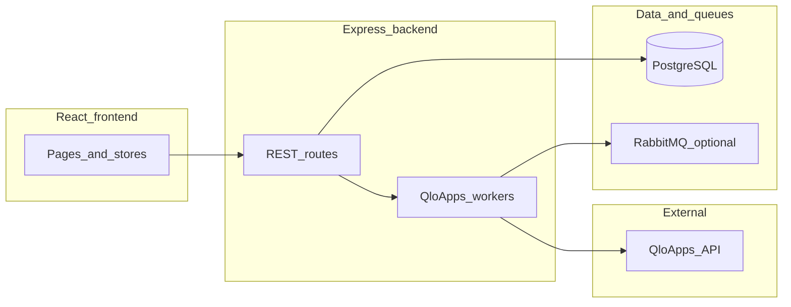

# PMS / QloApps use-case comparison report

## Document information

| Field | Value |
| --- | --- |
| Version | 1.0 |
| Date | 2026-04-15 |
| Baseline use cases | [USE_CASES.md](./USE_CASES.md) (v1.1) |
| Reference product | [QloApps Property Management Software](https://qloapps.com/property-management-software/) |

---

## 1. Executive summary

This repository implements a **custom Node.js (Express) + React** multi-property hotel operations platform with **PostgreSQL**, **JWT authentication**, hotel-scoped APIs (`X-Hotel-Id`), and a **deep QloApps integration layer** (REST client, RabbitMQ-backed workers, conflict resolution, room-type mappings, availability/rate sync). By contrast, **QloApps** is a **monolithic PHP + MySQL** product that bundles PMS, booking engine, guest-facing website, channel management, and a large add-on marketplace—so feature parity is not expected; the integration treats QloApps primarily as a **sync peer** for reservations, availability, and rates rather than as the sole system of record.

**Top gaps to be aware of:**

1. **Auth self-service:** Password reset and change-password flows described in the use case doc are **not** exposed as API routes; only login, register, refresh, and `/me` exist.
2. **Invoice PDF / exports:** There is **no** PDF generation for invoices and **no** first-class export endpoints for reports or audit logs.
3. **QloApps operational UI:** The backend exposes configuration, sync, mappings, conflict resolution, and sync logs; the **React app** covers setup, test connection, and sync/status—**not** conflict resolution, reservation/customer mapping screens, or sync log browsing.
4. **Commercial PMS depth (QloApps marketing):** Vouchers, advanced pricing rules, extra services as sellable lines, multilingual/currency, and guest-facing booking UX are **out of scope** for [USE_CASES.md](./USE_CASES.md) and largely absent from this codebase.
5. **Notifications:** “Notifications” in the UI are largely **client-derived** (derived from loaded reservations, invoices, housekeeping) rather than persisted server notifications with delivery guarantees as implied by UC-1101–1106.

---

## 2. Methodology

Each use case group in [USE_CASES.md](./USE_CASES.md) was classified against the codebase using:

| Classification | Meaning |
| --- | --- |
| **Implemented** | Matching API routes and, where applicable, primary UI screens exist for the core flow. |
| **Partial** | Core data path exists but UX, edge cases, exports, or RBAC differ from the document. |
| **API-only** | Backend supports the capability; no dedicated frontend workflow. |
| **Documented only** | Described in USE_CASES.md but no corresponding route or feature found. |
| **Not in doc (code exists)** | Implementation present but not listed as a named UC (e.g. check-in subsystem). |

**Sources:** Static review of [backend/src/routes.ts](../backend/src/routes.ts), service `*_routes.ts` files, [frontend/src/App.jsx](../frontend/src/App.jsx), [frontend/src/utils/api.js](../frontend/src/utils/api.js), and QloApps’s public PMS marketing page (not QloApps source code).

---

## 3. QloApps capability map (reference)

Summarized from [QloApps PMS](https://qloapps.com/property-management-software/) for directional comparison only.

| Domain | QloApps (marketing) |
| --- | --- |
| **Reservations** | Online and offline bookings; guest CRM-style data; secure payments; taxes and invoicing; offers and promotions; flexible booking edits. |
| **Property** | Multi-property; room types; inventory; amenities; extra services; base and max occupancy per type. |
| **Rates** | Pricing plans; advance pricing rules; group-wise pricing. |
| **Staff** | Staff profiles and permission control. |
| **Ecosystem** | Dashboard, reporting, API/import, channel management; multilingual/currency; email marketing (listed as default). Extended add-ons (e.g. housekeeping module, online check-in, rewards, GDPR) sold separately. |

**Integration note:** In this project, QloApps is integrated via **API + optional message queue**, while the marketing product is a **single deployable** with front office, back office, and website. Stakeholders should not assume “channel manager” in [USE_CASES.md](./USE_CASES.md) means QloApps is only distribution—it is a full PMS/booking stack; here it acts mainly as a **synchronization endpoint** for selected entities.

---

## 4. Matrix: USE_CASES vs implementation

### 4.0 QloApps capability delivery (normative)

| Capability | Primary product UI | API / tooling | Notes |
| --- | --- | --- | --- |
| Config + test connection + trigger sync + sync status | Settings channel tab | Same | Implemented in SPA |
| Conflict resolution, entity mappings, sync logs | **Not in main SPA** | `/v1/qloapps/*` REST | Use API/admin tools or extend UI later |
| Workers (inbound/outbound/scheduler) | N/A (background) | Docker profiles | Required for sync |

| Area | Representative UCs | Backend | Frontend | Assessment |
| --- | --- | --- | --- | --- |
| Authentication | UC-001–006 | [auth_routes.ts](../backend/src/services/auth/auth_routes.ts): `login`, `register`, `refresh`, `me`, `forgot-password`, `reset-password`, `change-password` | [LoginPage.jsx](../frontend/src/pages/LoginPage.jsx); [api.js](../frontend/src/utils/api.js) | **Implemented** (UC-004/005 API); UC-006 via users API + Settings |
| Guest management | UC-101–107 | CRUD + `POST /v1/guests/:id/merge` [guests_routes.ts](../backend/src/services/guests/guests_routes.ts) | [GuestsPage.jsx](../frontend/src/pages/GuestsPage.jsx), [GuestProfilePage.jsx](../frontend/src/pages/GuestProfilePage.jsx); `api.guests.merge` | **Partial** — UC-106 merge **API** present; UI may still need explicit merge action |
| Room management | UC-201–209 | [rooms_routes.ts](../backend/src/services/rooms/rooms_routes.ts), housekeeping sub-routes | [RoomsPage.jsx](../frontend/src/pages/RoomsPage.jsx) | **Implemented** — rates tied to **room types** and generated rooms (see §6) |
| Room types / rates | UC-207 (implicit) | [room_types_routes.ts](../backend/src/services/room_types/room_types_routes.ts) | [RoomTypesPage.jsx](../frontend/src/pages/RoomTypesPage.jsx) | **Implemented** — `price_per_night` on room type; physical rooms copy price on create |
| Reservations | UC-301–312 | [reservations_routes.ts](../backend/src/services/reservations/reservations_routes.ts), [check_ins_routes.ts](../backend/src/services/check_ins/check_ins_routes.ts) | [ReservationsPage.jsx](../frontend/src/pages/ReservationsPage.jsx), [CalendarPage.jsx](../frontend/src/pages/CalendarPage.jsx), [BookingTimeline.jsx](../frontend/src/components/BookingTimeline.jsx) | **Partial** — UC-309/312: API + **UI** for second guest when room type is Double; timeline supports secondary guest |
| Check-in / check-out | UC-305–306 (flows) | `check_ins` service ([check_ins_service.ts](../backend/src/services/check_ins/check_ins_service.ts)) | [CheckInsPage.jsx](../frontend/src/pages/CheckInsPage.jsx) | **Implemented** — see business rules in §6 |
| Invoices & payments | UC-401–409 | [invoices_routes.ts](../backend/src/services/invoices/invoices_routes.ts) incl. `GET /v1/invoices/:id/pdf` | [InvoicesPage.jsx](../frontend/src/pages/InvoicesPage.jsx); `api.invoices.downloadPdf` | **Partial** — UC-407 PDF **API**; UI download wiring optional |
| Housekeeping | UC-501–507 | Housekeeping update in [rooms_controller.ts](../backend/src/services/rooms/rooms_controller.ts) (`assigned_staff_id`, `assigned_staff_name`) | [RoomsPage.jsx](../frontend/src/pages/RoomsPage.jsx) (housekeeping tab) | **Implemented** — UC-503 supported at API; UI depth varies |
| Maintenance | UC-601–607 | [maintenance_routes.ts](../backend/src/services/maintenance/maintenance_routes.ts) | [MaintenancePage.jsx](../frontend/src/pages/MaintenancePage.jsx) | **Implemented** |
| Expenses | UC-701–707 | [expenses_routes.ts](../backend/src/services/expenses/expenses_routes.ts) — create/update Admin/Manager; view includes Viewer | [ExpensesPage.jsx](../frontend/src/pages/ExpensesPage.jsx) | **Implemented** — aligned with USE_CASES actor tables |
| Reporting & analytics | UC-801–808 | `/v1/reports/stats`, `/v1/reports/export.csv` | [DashboardPage.jsx](../frontend/src/pages/DashboardPage.jsx), [ReportsPage.jsx](../frontend/src/pages/ReportsPage.jsx) | **Partial** — CSV export API; dashboard may not link export yet |
| Audit | UC-901–905 | [audit_routes.ts](../backend/src/services/audit/audit_routes.ts) incl. `GET /v1/audit-logs/export.csv`, VIEWER read | [AuditLogsPage.jsx](../frontend/src/pages/AuditLogsPage.jsx) | **Partial** — VIEWER **can** read audit; export API present |
| QloApps integration | UC-1001–1008 | [qloapps_routes.ts](../backend/src/services/qloapps/qloapps_routes.ts), workers under `integrations/qloapps/` | [SettingsPage.jsx](../frontend/src/pages/SettingsPage.jsx) channel tab; [api.js](../frontend/src/utils/api.js) | **Partial** — see **§4.0** delivery matrix |
| Notifications | UC-1101–1106 | `GET/PATCH/POST` under `/v1/notifications` + emitters in check-in, checkout, maintenance, housekeeping | [Notifications.jsx](../frontend/src/components/Notifications.jsx) loads server inbox | **Implemented** (server-backed); reminders are event-driven, not a separate cron |

### 4.1 Auth detail (UC-001–006)

- **Present:** `POST /api/auth/login`, `POST /api/auth/register`, `POST /api/auth/refresh`, `GET /api/auth/me`, `POST /api/auth/forgot-password`, `POST /api/auth/reset-password`, `POST /api/auth/change-password` ([auth_routes.ts](../backend/src/services/auth/auth_routes.ts)).
- **Reset email:** link is **logged** when SMTP is not configured; set `PASSWORD_RESET_PUBLIC_URL` / SMTP when enabling production email.
- **UC-006 Manage User Roles:** `GET/POST/PUT/DELETE /api/v1/users` for `ADMIN` / `SUPER_ADMIN` ([users_routes.ts](../backend/src/services/users/users_routes.ts)); staff UI in Settings.

### 4.2 Guests (UC-106, UC-107)

- **UC-106 Merge duplicate guests:** `POST /api/v1/guests/:id/merge` with `{ target_guest_id }` (Admin/Manager); QloApps may still dedupe during pull separately.
- **UC-107 Notes:** [GuestProfilePage.jsx](../frontend/src/pages/GuestProfilePage.jsx) appends timestamped notes via guest update.

### 4.3 Rooms and rates (UC-207)

- **Room-type-centric pricing:** [room_types_controller.ts](../backend/src/services/room_types/room_types_controller.ts) sets `price_per_night` on the room type; generated physical rooms receive that price when created. Per-room overrides may exist on `rooms.price_per_night` for legacy paths—operators should treat **canonical commercial rate** as room-type driven for new data.

### 4.4 Reservations and “double room” (UC-309, UC-312)

- **API:** `secondary_guest_id` and related fields in [reservations_types.ts](../backend/src/services/reservations/reservations_types.ts).
- **UI:** [ReservationsPage.jsx](../frontend/src/pages/ReservationsPage.jsx) prompts for a second guest when the selected room type is Double; [BookingTimeline.jsx](../frontend/src/components/BookingTimeline.jsx) can set `secondary_guest_id`.

### 4.5 Invoices (UC-407, UC-409)

- **UC-407 Generate Invoice PDF:** No PDF pipeline in [invoices](../backend/src/services/invoices/).
- **UC-409 Auto-generate on check-out:** Implemented in [check_ins_service.ts](../backend/src/services/check_ins/check_ins_service.ts) **after** the checkout transaction: invoice insert uses reservation total unless checkout payload overrides amount; **skips** creation if computed amount ≤ 0 (returns `checkout_invoice_error`).

### 4.6 QloApps frontend coverage

Client calls include QloApps config, delete config, test connection (via settings channel-manager endpoint), `POST /v1/qloapps/sync`, and `GET /v1/qloapps/sync/status` ([api.js](../frontend/src/utils/api.js)). There are **no** frontend calls to `/v1/qloapps/mappings/*`, `/v1/qloapps/sync-logs`, or conflict resolution endpoints—those remain **API-only** for tools or future UI.

### 4.7 Notifications (UC-1101–1106)

- **Server:** `notifications` table + `/api/v1/notifications` API; **client:** [Notifications.jsx](../frontend/src/components/Notifications.jsx) loads from API. Event hooks create rows for housekeeping/maintenance/check-in/out flows.

---

## 5. Missing or weak use cases vs QloApps

### 5.1 In QloApps marketing, largely not in USE_CASES.md

- Vouchers and promotions; advanced rate rules and group pricing; extra services catalog; rich amenities merchandising; multilingual/currency; guest-facing booking website; broad payment gateway options; loyalty/rewards (add-on); email marketing modules.

### 5.2 In USE_CASES.md but weak or absent in code

| UC / theme | Gap |
| --- | --- |
| UC-004, UC-005 | No password reset/change API |
| UC-106 | No operator-facing merge API |
| UC-407 | No invoice PDF |
| UC-806, UC-903 | No export endpoints |
| UC-901 (VIEWER) | Audit API excludes VIEWER |
| UC-1005–1007 | Conflict handling and sync logs: **backend yes**, **admin UI no** |
| UC-1101–1106 | No server-side notification model matching the doc |

---

## 6. Business logic differences (document vs code)

### 6.1 Check-in and check-out dates

- **USE_CASES.md** describes check-in/out relative to “today” in plain language.
- **Code** uses the hotel’s **timezone** and compares **local calendar dates** ([check_ins_service.ts](../backend/src/services/check_ins/check_ins_service.ts), [hotel_date.ts](../backend/src/utils/hotel_date.ts)): e.g. cannot check in before scheduled arrival date in hotel local time; cannot check out before scheduled departure date in hotel local time.

### 6.2 Check-out and invoice

- Checkout **updates reservation, room, and housekeeping inside a transaction**, then **creates the invoice outside** that transaction.
- If the invoice insert fails, the stay is already checked out; the API can still return `checkout_invoice_error`.
- Staff may pass a **checkout amount override** on `PATCH .../checkout` (see comment in [check_ins_routes.ts](../backend/src/services/check_ins/check_ins_routes.ts)).

### 6.3 “Double room” semantics

- **UC-309** in the doc refers to business rules for double occupancy.
- **Code** distinguishes (a) **room type** label (e.g. Double) and (b) **second guest** on the reservation (`secondary_guest_id`). UI encourages a second guest for Double rooms but the rules are not identical to QloApps’s cart/booking engine.

### 6.4 Expenses RBAC

- [expenses_routes.ts](../backend/src/services/expenses/expenses_routes.ts) allows `FRONT_DESK` on create/update; [USE_CASES.md](./USE_CASES.md) lists Admin and Manager only for UC-701–703.

### 6.5 Terminology: QloApps as “channel manager”

- [USE_CASES.md](./USE_CASES.md) §11 frames QloApps as “Channel Manager Integration.” QloApps’s own positioning includes **full PMS + booking engine + website**. This project’s integration is **bidirectional sync** with QloApps APIs, not only OTA distribution—wording in docs may confuse stakeholders.

---

## 7. Recommendations (prioritized)

1. **Align RBAC with reality:** Update [USE_CASES.md](./USE_CASES.md) actor tables (audit VIEWER, expenses FRONT_DESK) or change `requireRole` calls to match the intended policy.
2. **QloApps UX or documentation:** Either add admin screens for conflicts, mappings, and sync logs (UC-1005–1007) or mark those UCs as **operator/API-only** in the spec.
3. **Auth and exports:** Implement UC-004/005 or remove from “High” priority until planned; same for UC-407, UC-806, UC-903.
4. **Guest merge:** Implement UC-106 as an explicit transactional merge API or remove from scope.
5. **Product roadmap (optional):** If competing with QloApps feature breadth, prioritize taxes/promotions/extra services only after core spec/code alignment.

---

## 8. Appendix

### 8.1 Architecture (high level)

### 8.2 File index (primary)

| Concern | Backend entry | Frontend |
| --- | --- | --- |
| API mount | [routes.ts](../backend/src/routes.ts) | [App.jsx](../frontend/src/App.jsx) routes |
| Auth | [auth_routes.ts](../backend/src/services/auth/auth_routes.ts) | [LoginPage.jsx](../frontend/src/pages/LoginPage.jsx) |
| Hotels / settings | [hotels_routes.ts](../backend/src/services/hotels/hotels_routes.ts), [settings_routes.ts](../backend/src/services/settings/settings_routes.ts) | [SettingsPage.jsx](../frontend/src/pages/SettingsPage.jsx) |
| QloApps | [qloapps_routes.ts](../backend/src/services/qloapps/qloapps_routes.ts) | Settings channel tab |
| Reservations / check-ins | [reservations_routes.ts](../backend/src/services/reservations/reservations_routes.ts), [check_ins_routes.ts](../backend/src/services/check_ins/check_ins_routes.ts) | [ReservationsPage.jsx](../frontend/src/pages/ReservationsPage.jsx), [CheckInsPage.jsx](../frontend/src/pages/CheckInsPage.jsx) |

### 8.3 Related links

- [USE_CASES.md](./USE_CASES.md)
- [QloApps Property Management Software](https://qloapps.com/property-management-software/)

---

*End of report.*
