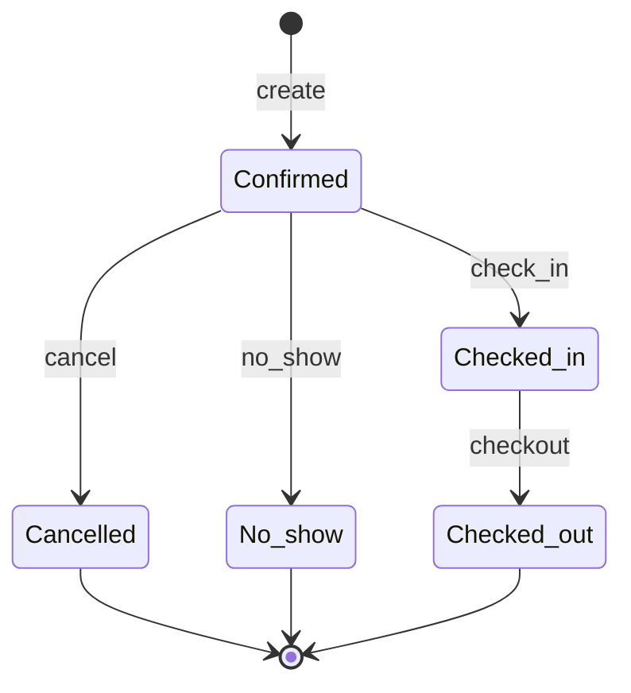

# Data Model: Reservation to Check-out Lifecycle

**Feature**: [spec.md](./spec.md)  
**Date**: 2026-04-15  
**Authority**: Knex migrations under `backend/src/database/migrations/` for as-built; this file adds **planned deltas** for spec alignment.

## Reservation (business states)

| State | DB today | Spec | Notes |
|--------|----------|------|--------|
| Confirmed | ✓ | ✓ | Default |
| Checked-in | ✓ | ✓ | Via check-in + `checkin_id` |
| Checked-out | ✓ | ✓ | Via checkout |
| Cancelled | ✓ | ✓ | Constraint allows |
| No-show | ✗ | ✓ | **Migration**: extend `check_reservations_status` |

**Transitions (spec)**

- Confirmed → Checked-in (check-in API)
- Confirmed → Cancelled, Confirmed → No-show (API + validation; release inventory)
- Checked-in → Checked-out (checkout API)
- Terminal: Cancelled, No-show, Checked-out — no check-in/out

**Fields (as-built highlights)**

- `hotel_id`, `primary_guest_id`, `check_in`, `check_out`, `status`, `total_amount`, `source`, `room_type_id`, `reserved_room_id`, `room_id` (legacy/compat), `checkin_id`, optional external ids

## Check-in

- **Table**: `check_ins` — `reservation_id`, `actual_room_id`, `status` (`checked_in` | `checked_out`), times, `checked_in_by`, notes, `hotel_id`
- **Table**: `room_assignments` — audit trail for initial assign + `changeRoom` (from/to room, type, reason)

**Invariant**: At most one active `checked_in` row per reservation (`checkin_id` on reservation).

## Room & housekeeping

- **rooms.status**: Available, Occupied, Cleaning, Out of Service (verify enum in code/migrations)
- **housekeeping.status**: Dirty / etc., keyed by `room_id`

Room move updates **prior** room to Cleaning + Dirty and **new** room to Occupied.

## Invoice

**As-built** (`invoices`): `hotel_id`, `reservation_id`, `guest_id`, `issue_date`, `due_date`, `amount`, `status`, `payment_method`, `notes`, …

**Planned for spec**

- **Single `amount`** remains the rolled-up total (FR-014).
- Optional columns for reconciliation (recommended): `calculated_amount` (decimal, nullable), `amount_entered_by` (uuid FK users, nullable), `amount_entered_at` (timestamptz, nullable) — or equivalent captured only in `audit_logs` if schema minimalism preferred.
- **Check-out** creates invoice with default `amount` = calculated stay total unless request supplies override; if override ≠ calculated, write audit event (FR-004, FR-011).

## Audit

Use `audit_utils` (`logCreate`, `logUpdate`, `logAction`) for:

- check-in, check-out, room change (existing patterns)
- **invoice created at check-out** with payload including `calculated_amount` and `final_amount` when they differ

## Validation rules (application layer)

| Rule | Entity | Source |
|------|--------|--------|
| Check-in only from Confirmed | reservation | FR-001, existing service |
| Block check-in if Cancelled / No-show | reservation | FR-002 |
| Check-in date ≤ “today” in hotel TZ | reservation.check_in | UC-305, FR-001 |
| Check-out only from Checked-in | reservation | FR-001 |
| Check-out date ≤ “today” in hotel TZ | reservation.check_out | UC-306 |
| New room not overlapping other stays | room + reservations | FR-013 |

## State diagram (condensed)

